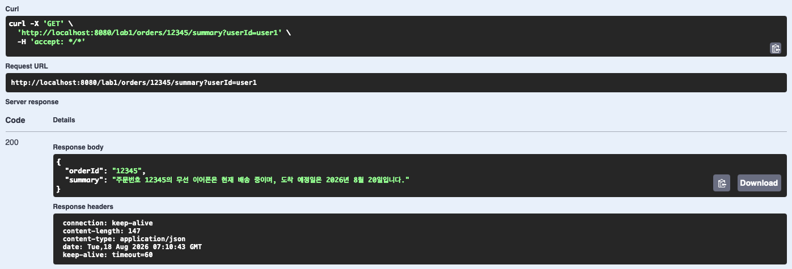
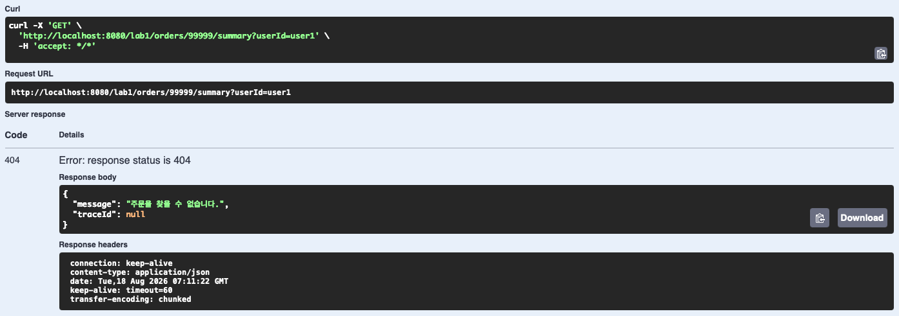
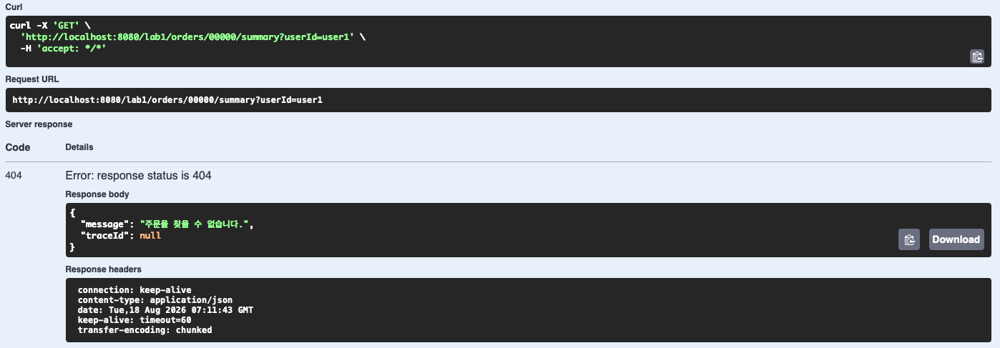
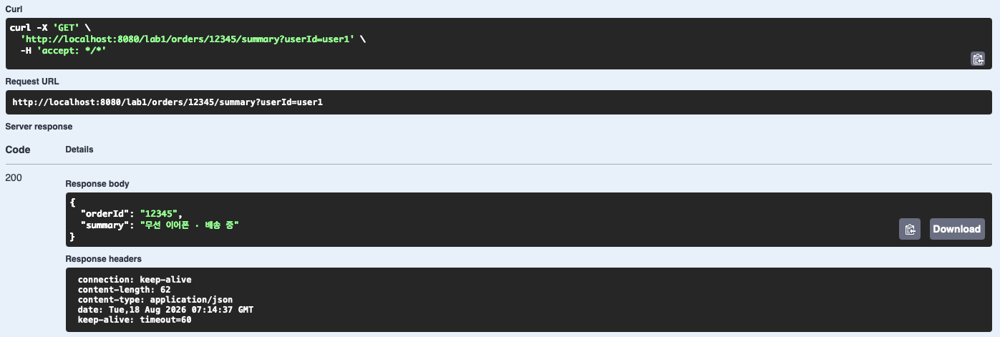
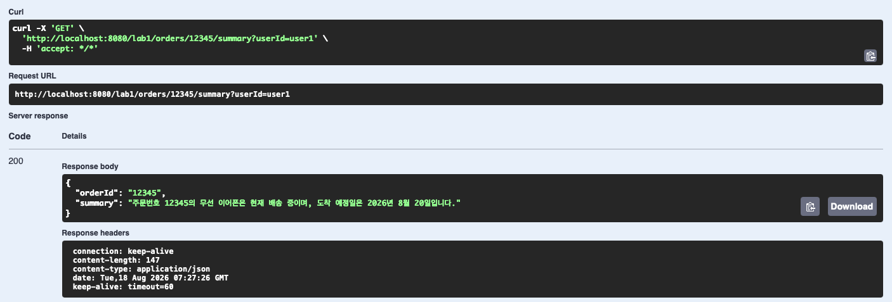
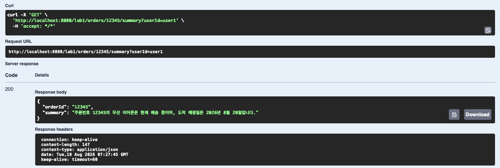
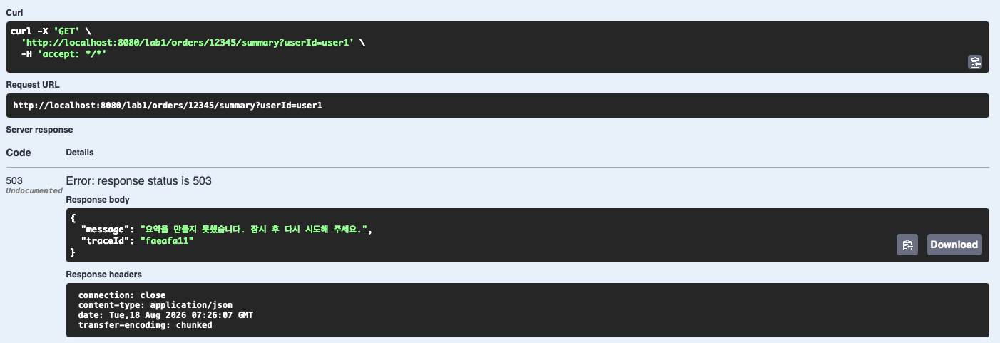

# SpringAI 이해 및 활용 — Day 1 실습과제 결과 보고서

**메인 실습 · 주문 요약 API (Spring AI ChatClient + 3계층 + 폴백)**

| 항목        | 내용                                                                                                                                                             |
| ----------- | ---------------------------------------------------------------------------------------------------------------------------------------------------------------- |
| 조원        | 황재원 (P345) · 박성우 (P322)                                                                                                                                    |
| 실습 일자   | 2026-08-18                                                                                                                                                       |
| 산출물 위치 | `SpringAI_실습/07_주문요약_메인실습` (별도 리포지토리: [github.com/wodnjs2020136144/day1-order-summary](https://github.com/wodnjs2020136144/day1-order-summary)) |
| 제출 성격   | 평가 없음 — 실행/테스트 결과 캡처 및 설명 제출                                                                                                                   |

---

## 1. 실습 개요

교안 메인 실습(p.94–101) 목표는 주문 하나를 AI가 한 문장으로 요약하는 API를 3계층 규칙대로 완성하는 것이다. 2인 1조로 계층 경계를 따라 역할을 나누어 직접 구현했다.

| 담당                                  | 조원          | 구현 파일                                                                          |
| ------------------------------------- | ------------- | ---------------------------------------------------------------------------------- |
| AI 계층 (설정·업무 흐름·폴백)         | 황재원 (P345) | `Lab1AiConfig.java`, `OrderSummaryService.java`                                    |
| 웹·데이터 계층 (저장소·컨트롤러·예외) | 박성우 (P322) | `OrderRepository.java`, `OrderSummaryController.java`, `Lab1ExceptionHandler.java` |

| 항목            | 내용                                                                                                |
| --------------- | --------------------------------------------------------------------------------------------------- |
| 엔드포인트      | `GET /lab1/orders/{orderId}/summary?userId=...`                                                     |
| 계층 구조       | Controller → Service → (Repository + ChatClient)                                                    |
| 사용 스택       | JDK 21 · Spring Boot 4.1.0 · spring-ai-bom 2.0.0 · spring-ai-starter-model-openai · springdoc 2.8.6 |
| ChatClient 옵션 | temperature = 0.0 · maxTokens = 120 (재현성·비용 상한 고정)                                         |
| 폴백 정책       | 모델 호출 실패 또는 `finishReason=length` 시 "상품명 · 상태" 형식으로 200 응답                      |

---

## 2. 자동 테스트 실행 결과

모델 호출 없이 도는 단위/웹 계층 테스트 2종을 실제로 실행해 통과를 확인했다 (`OrderSummaryControllerTest` 2건, `OrderSummaryServiceTest` 2건 — 총 4건 성공).

```
$ ./gradlew test

> Task :compileJava UP-TO-DATE
> Task :processResources UP-TO-DATE
> Task :classes UP-TO-DATE
> Task :compileTestJava
> Task :processTestResources NO-SOURCE
> Task :testClasses
> Task :test

BUILD SUCCESSFUL in 2s
4 actionable tasks: 2 executed, 2 up-to-date

[통과] OrderSummaryControllerTest
  - 정상_주문은_200과_요약을_돌려준다()
  - 남의_주문이거나_없는_주문은_404다()
[통과] OrderSummaryServiceTest
  - 없는_주문이거나_남의_주문이면_모델을_부르지_않고_예외를_던진다()
  - 모델_호출이_실패해도_주문_정보는_200으로_나간다()
```

**완료 기준 3번(계층 분리) 기계적 확인:**

```
$ grep -rn "ChatClient" src/main/java/com/skala/day1/web/
(일치하는 import 없음 — 컨트롤러가 ChatClient를 모른다)
```

---

## 3. 실행 결과 캡처 (Swagger UI)

실제 `OPENAI_API_KEY`로 서버를 기동해 Swagger UI(`/swagger-ui/index.html`)에서 Try it out으로 6가지 시나리오를 직접 호출하고 응답을 캡처했다.

### 3-1. 정상 응답 — 완료 기준 1번

`GET /lab1/orders/12345/summary?userId=user1` — 본인 소유 주문을 실제 키로 요약 요청.



**결과**: 200 OK, `summary = "주문번호 12345의 무선 이어폰은 현재 배송 중이며, 도착 예정일은 2026년 8월 20일입니다."` — temperature 0으로 고정된 실제 모델 응답.

### 3-2. 권한 격리 — 완료 기준 2번

`GET /lab1/orders/99999/summary?userId=user1` — 99999는 user2 소유 주문.



**결과**: 404 Not Found, `message = "주문을 찾을 수 없습니다."` — 남의 주문에 접근했을 때 모델을 부르지 않고 즉시 거부됨.

### 3-3. 존재하지 않는 주문 — 완료 기준 2번 보강

`GET /lab1/orders/00000/summary?userId=user1` — 아예 존재하지 않는 주문번호.



**결과**: 남의 주문(3-2)과 동일하게 404 — 존재 여부를 구분해서 알려주지 않는다(정보 노출 방지).

### 3-4. 폴백 동작 — 완료 기준 8번 (오늘의 핵심 학습 지점)

서버를 `OPENAI_API_KEY=dummy`로 재기동한 뒤 `GET /lab1/orders/12345/summary?userId=user1` 재호출.



**결과**: 모델 호출이 실패해도 503이 아니라 200 OK, `summary = "무선 이어폰 · 배송 중"`(서비스 계층 폴백 문구) — AI 실패가 API 전체 실패로 번지지 않음을 실측 확인.

### 3-5. 재현성 — 완료 기준 5번

`GET /lab1/orders/12345/summary?userId=user1`을 실제 키로 19초 간격 3회 연속 호출.





**결과**: 07:27:26 / 07:27:45 / 07:27:55, 세 번 모두 `summary = "주문번호 12345의 무선 이어폰은 현재 배송 중이며, 도착 예정일은 2026년 8월 20일입니다."`로 완전히 동일 — `temperature=0.0` 고정이 재현성으로 이어짐을 실측 확인.

### 3-6. 503 + traceId — 완료 기준 7번

`OrderSummaryService.callModel()`은 평소 모델 호출 실패를 내부에서 잡아 폴백(200)으로 바꾸기 때문에, 정상 상태에서는 `Lab1ExceptionHandler`의 503 분기에 도달할 방법이 없다(이것이 8번 폴백이 의도한 동작이다). 503 응답 자체를 직접 확인하기 위해 `callModel()`의 `try/catch`를 **일시적으로 제거**해 예외가 컨트롤러까지 올라가도록 만든 뒤, `OPENAI_API_KEY=dummy`로 호출해 캡처하고 즉시 원상복구했다.



**결과**: 503 Service Unavailable, `message = "요약을 만들지 못했습니다. 잠시 후 다시 시도해 주세요."`, `traceId = "faeafa11"` — 스택트레이스 없이 안전한 문구와 추적 ID만 노출됨을 확인. (⚠️ 이 캡처만 예외 처리 코드를 잠시 비활성화한 상태에서 얻었고, 캡처 직후 원래 코드로 복구했다. 저장소·제출 코드에는 반영되지 않았다.)

---

## 4. 완료 기준 체크리스트

| 번호 | 기준                                    | 결과                                    | 근거                     |
| ---- | --------------------------------------- | --------------------------------------- | ------------------------ |
| 1    | 엔드포인트 동작 (12345/user1 → 200)     | ✅ 확인                                 | 3-1 캡처                 |
| 2    | 권한 격리 (99999 → 404)                 | ✅ 확인                                 | 3-2 캡처                 |
| 3    | 계층 분리 (컨트롤러에 ChatClient 없음)  | ✅ 확인                                 | grep 결과 (2절)          |
| 4    | 빈 구성 (ChatClient 빈이 config에 하나) | ✅ 확인                                 | `Lab1AiConfig.java`      |
| 5    | 옵션 고정 (같은 입력 → 거의 같은 답)    | ✅ 확인                                 | 3-5 캡처 (3회 완전 동일) |
| 6    | 문서화 (Swagger 설명·예시·404)          | ✅ 확인                                 | 3절 캡처 전체            |
| 7    | 실패 처리 (모델 오류 시 503 + traceId)  | ✅ 확인 (예외처리 임시 비활성화로 재현) | 3-6 캡처                 |
| 8    | 폴백 (AI 실패해도 주문 정보는 나감)     | ✅ 확인                                 | 3-4 캡처                 |

8개 전부 화면으로 실측 확인했다. 단 7번은 정상 운영 코드에서는 도달하지 않는 경로라서, 확인을 위해 예외 처리를 일시적으로 비활성화하는 결함 주입(fault injection) 방식을 썼다는 점을 명시한다.

---

## 5. 협업 방식

계층 경계(Controller/Repository ↔ Service/Config)를 기준으로 역할을 나눴다. 갈라지기 전에 도메인 모델(`Order`, `OrderStatus`)과 저장소 시그니처, 응답 DTO를 먼저 계약으로 고정한 뒤 각자 맡은 파일을 구현하고 합쳤다. 황재원(P345)은 AI 계층(`Lab1AiConfig`, `OrderSummaryService`), 박성우(P322)는 웹·데이터 계층(`OrderRepository`, `OrderSummaryController`, `Lab1ExceptionHandler`)을 담당했다 — 각 파트의 상세 설계 근거는 7절에 정리했다.

---

## 6. 오늘 배운 핵심 개념과 구현 반영

이번 실습에서 다룬 개념 8가지를 실제로 어느 코드에 어떻게 반영했는지 정리한다. 단순히 "동작하는 코드"가 아니라 교안이 강조한 원칙을 얼마나 지켰는지가 핵심이다.

| # | 배운 개념 | 반영한 코드 | 왜 중요한가 |
|---|---|---|---|
| 1 | 3계층 분리 — Controller는 AI를 몰라야 한다 | `OrderSummaryController`에 `ChatClient` import가 없다 (2절 grep으로 기계적 확인) | 나중에 모델 공급자를 바꾸거나 요약 로직을 손봐도 웹 계층은 전혀 건드릴 필요가 없다. 계층 경계가 곧 변경 파급 범위를 결정한다 |
| 2 | 용도별 ChatClient 빈 분리 | `Lab1AiConfig.summaryChatClient()` — 요약 전용 빈 하나만 정의 | `04_말투바꾸기`에서 배운 패턴(용도마다 빈을 나눈다)을 그대로 적용했다. 지금은 용도가 하나뿐이지만, 나중에 "번역 전용", "분류 전용" 빈이 추가돼도 서로 설정이 섞이지 않는다 |
| 3 | temperature·maxTokens는 빈에 고정, 호출부에서 정하지 않는다 | `Lab1AiConfig`에서 `temperature(0.0)`, `maxTokens(120)` 고정 | 호출부마다 옵션을 정하게 두면 누군가 기본값(0.7)으로 부르는 순간부터 요약이 매번 달라진다. 실제로 3-5 캡처에서 3회 완전 동일한 응답으로 이 설계가 재현성을 만든다는 것을 확인했다 |
| 4 | 프롬프트 인젝션 방지 — `{placeholder}` + `.param()` 바인딩 | `OrderSummaryService.callModel()`의 `.user(u -> u.text("...{id}...").param("id", ...))` | `05_이모지요약기`의 v1(`"이 글 요약해줘: " + text` 문자열 이어붙이기)이 안티패턴으로 제시된 이유를 실제로 피해서 짰다. 사용자 입력이 프롬프트 구조를 깨거나 지시를 덮어쓸 수 없다 |
| 5 | `finishReason=length`를 정상 응답으로 취급하지 않는다 | `callModel()`에서 `chatResponse()`로 받아 `getFinishReason()`이 `LENGTH`면 폴백으로 대체 | maxTokens 상한(120)에 걸려 문장이 중간에서 끊겨도 그 잘린 문장을 사용자에게 그대로 보내지 않는다. p.85가 지적한 "잘린 응답을 정상 처리로 넘기는" 실수를 코드로 막았다 |
| 6 | AI 실패가 전체 API 실패로 번지지 않게 한다 (폴백) | `callModel()`의 `try/catch(Exception e)` → `fallback(order)` | 모델 호출 실패는 부가 기능(요약)의 실패일 뿐, 핵심 데이터(주문 정보)까지 못 돌려줄 이유는 없다. 3-4 캡처에서 더미 키로 실제 실패를 유도해 200 + 폴백 문구가 나오는 것을 확인했다 |
| 7 | 예외 처리는 한 곳(`@RestControllerAdvice`)에 모으고, 응답에는 안전한 문구 + traceId만 노출한다 | `Lab1ExceptionHandler` — 스택트레이스는 `log.error`에만, 응답 바디는 `message`+`traceId` | 3-6 캡처(결함 주입으로 재현한 503)에서 `traceId`만 노출되고 내부 예외 내용은 로그로만 남는 것을 확인했다. 사용자에게 시스템 내부 구조를 노출하지 않으면서도 장애 추적은 가능하게 하는 설계다 |
| 8 | 존재하지 않는 주문과 남의 주문을 구분해서 알려주지 않는다 | `OrderRepository.findByIdAndOwnerId()`가 두 경우 모두 빈 `Optional`을 반환 → 둘 다 동일한 404 | 3-2·3-3 캡처가 완전히 같은 응답이다. "이 주문번호는 존재하는데 권한이 없다"와 "아예 존재하지 않는다"를 구분해서 알려주면, 공격자가 유효한 주문번호를 추측하는 데 쓸 수 있는 정보를 새어나가게 한다 |

이 외에도 구현 과정에서 실제로 부딪힌 것들:

- **spring-ai-bom 버전에 따라 `ChatClient.Builder.defaultOptions(...)`의 시그니처가 다르다.** 이 프로젝트(spring-ai-bom 2.0.0)는 아직 빌드되지 않은 `ChatOptions.Builder`를 받아 `.build()`를 붙이면 안 되는데, 미니 실습(1.1.8)의 `ToneConfig` 코드는 `.build()`를 붙인다. 처음에 `04_말투바꾸기` 패턴을 그대로 복사했다가 `incompatible types: ChatOptions cannot be converted to Builder` 컴파일 에러를 실제로 겪고 나서 고쳤다.
- **Spring Boot 4부터 `@WebMvcTest`가 다른 패키지·다른 스타터(`spring-boot-starter-webmvc-test`)로 옮겨졌다.** `spring-boot-starter-test`만으로는 테스트 컴파일이 안 돼서 의존성을 추가로 넣어야 했다.

---

## 7. 담당 파트 상세 가이드 — AI 계층 (황재원 · P345)

발표·질의응답에서 이 파트를 설명할 때 쓸 수 있도록, 담당한 두 파일을 코드 흐름 순서대로 정리했다.

### 7-1. `Lab1AiConfig.java` — "왜 빈을 이렇게 만들었나"

```java
@Configuration
class Lab1AiConfig {
    @Bean
    ChatClient summaryChatClient(ChatClient.Builder builder) {
        return builder
            .defaultSystem("""
                너는 이커머스 주문 상담 도우미다.
                주어진 주문 정보만 사용해 한국어 한 문장으로 요약한다.
                추측하지 않는다. 정보가 부족하면 "정보가 부족합니다"라고 답한다.
                """)
            .defaultOptions(ChatOptions.builder()
                .temperature(0.0)
                .maxTokens(120))
            .build();
    }
}
```

**한 줄씩 설명하면:**

1. `ChatClient.Builder builder` 파라미터 — Spring Boot가 `spring-ai-starter-model-openai` 의존성만 보고 자동으로 만들어 주입해 주는 빌더다. 내가 직접 `new`로 만들 필요가 없다(자동 구성).
2. `.defaultSystem(...)` — 이 빈으로 나가는 모든 요청에 공통으로 붙는 시스템 프롬프트다. 여기서 세 가지를 못 박는다: **역할**(주문 상담 도우미), **제약**(주어진 정보만 사용, 추측 금지), **거절 규칙**(정보 부족 시 정형화된 문구). 이렇게 하면 매 호출마다 이 지시를 반복해서 써줄 필요가 없고, 실수로 빠뜨릴 일도 없다.
3. `.defaultOptions(ChatOptions.builder().temperature(0.0).maxTokens(120))` — **이 실습의 핵심 설계 판단.** `temperature(0.0)`은 "같은 입력이면 같은 출력"을 강제한다(요약은 창작이 아니라 정보 압축이어야 하므로 온도를 낮췄다). `maxTokens(120)`은 비용 상한이자 "한 문장 요약"이라는 요구사항을 강제하는 물리적 장치다.
4. 빈 이름을 `summaryChatClient`로 명시한 이유 — 같은 `ChatClient` 타입 빈이 나중에 늘어날 수 있으므로(예: 알림 문구 생성용 빈), 이름 매칭이 아니라 `@Qualifier("summaryChatClient")`로 명시적으로 골라 쓰게 했다(`OrderSummaryService` 생성자 참조).

### 7-2. `OrderSummaryService.java` — "AI 호출을 왜 이렇게 감쌌나"

```java
public SummaryResponse summarize(String orderId, String userId) {
    Order order = orders.findByIdAndOwnerId(orderId, userId)
            .orElseThrow(() -> new OrderNotFoundException(orderId));
    return new SummaryResponse(order.id(), callModel(order));
}

private String callModel(Order order) {
    try {
        ChatResponse response = summaryChat.prompt()
                .user(u -> u.text("주문번호 {id} · 상품 {item} · 상태 {status} · 도착예정 {eta}"
                                 + "\n위 정보를 한 문장으로 요약해 줘.")
                        .param("id", order.id())
                        .param("item", order.item())
                        .param("status", order.status().label())
                        .param("eta", order.eta()))
                .call()
                .chatResponse();

        String finishReason = response.getResult().getMetadata().getFinishReason();
        if ("LENGTH".equalsIgnoreCase(finishReason)) {
            return fallback(order);
        }
        return response.getResult().getOutput().getText();
    } catch (Exception e) {
        return fallback(order);
    }
}

private String fallback(Order order) {
    return order.item() + " · " + order.status().label();
}
```

**흐름을 설명하는 순서 (발표할 때 이 순서로):**

1. **`summarize()`가 먼저 하는 일 — 모델을 부르기 전에 권한부터 확인한다.** `orders.findByIdAndOwnerId(orderId, userId)`가 빈 `Optional`을 돌려주면 `OrderNotFoundException`을 던지고 그대로 끝난다. `callModel()`은 아예 호출되지 않는다 — 즉 **없는 주문이나 남의 주문에 대해서는 모델 호출 비용이 전혀 발생하지 않는다.** (완료 기준 7번 테스트 `OrderSummaryServiceTest.없는_주문이거나_남의_주문이면_모델을_부르지_않고_예외를_던진다()`가 이걸 검증한다.)
2. **프롬프트를 문자열로 이어 붙이지 않고 `{placeholder}` + `.param()`을 쓴 이유.** `order.item()`이나 `order.eta()`에 예를 들어 사용자가 통제할 수 있는 값이 들어간다면(지금은 고정 데이터라 안전하지만), 문자열 이어붙이기는 그 값이 프롬프트의 지시문처럼 해석될 위험이 있다. `.param()` 바인딩은 값과 지시문을 구조적으로 분리한다.
3. **`.call().chatResponse()`를 쓴 이유 — `.content()`가 아니라.** `.content()`는 텍스트만 돌려주지만, `finishReason`을 확인하려면 메타데이터가 필요하다. 그래서 `chatResponse()`로 전체 응답 객체를 받고, `getResult().getMetadata().getFinishReason()`으로 잘림 여부를 먼저 검사한 뒤에야 `getOutput().getText()`로 실제 텍스트를 꺼낸다.
4. **`try/catch`가 감싸는 범위가 `callModel()` 안쪽뿐인 이유.** `summarize()` 전체를 감쌌다면 `OrderNotFoundException`(404여야 할 케이스)까지 폴백으로 삼켜져서 항상 200이 나가는 버그가 생긴다. 그래서 **"권한 확인은 try 바깥, 모델 호출만 try 안쪽"**으로 명확히 나눴다. 이게 이 파일에서 가장 실수하기 쉬운 지점이다.
5. **`fallback()`이 반환하는 값 — 왜 원본 데이터를 그대로 조합하나.** AI가 만들어주는 "요약 문장"이 없어도, 사용자가 알아야 할 최소 정보(상품명·상태)는 원본 `Order`에서 바로 만들 수 있다. AI 계층이 통째로 죽어도 서비스는 절대 완전히 죽지 않는다는 게 이 실습의 핵심 메시지다.

---

## 8. 산출물 위치

GitHub: [https://github.com/wodnjs2020136144/day1-order-summary](https://github.com/wodnjs2020136144/day1-order-summary)
(`SpringAI_실습/07_주문요약_메인실습` 폴더를 별도 리포지토리로 분리)
